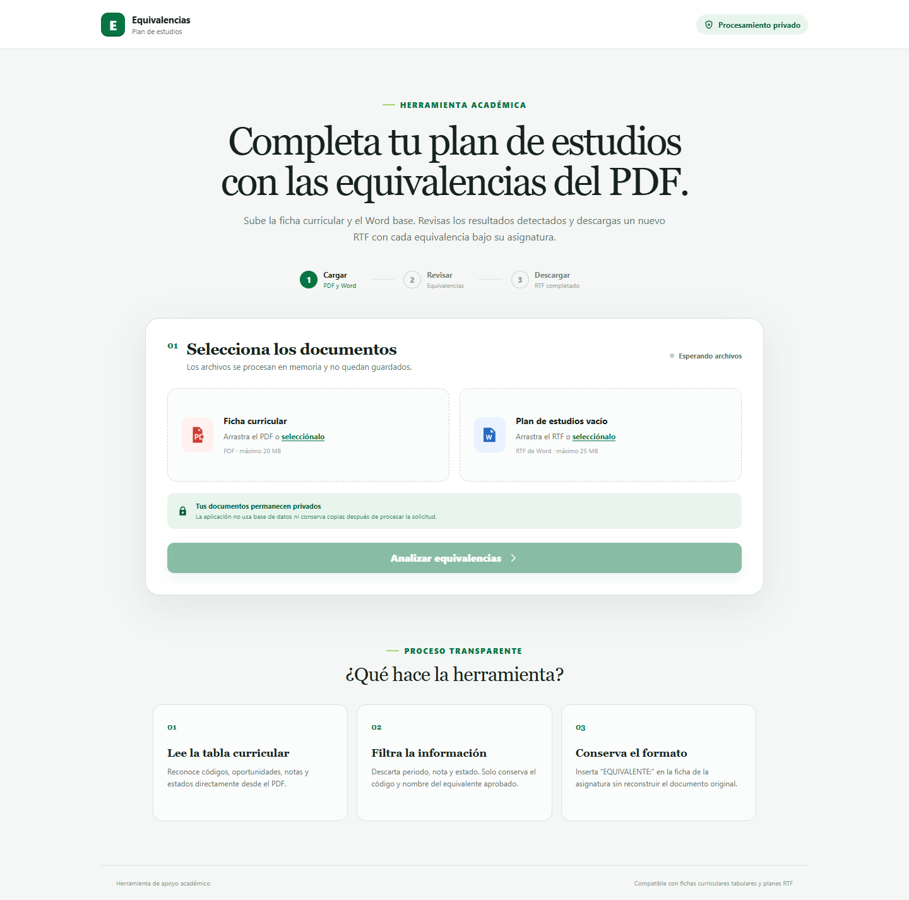
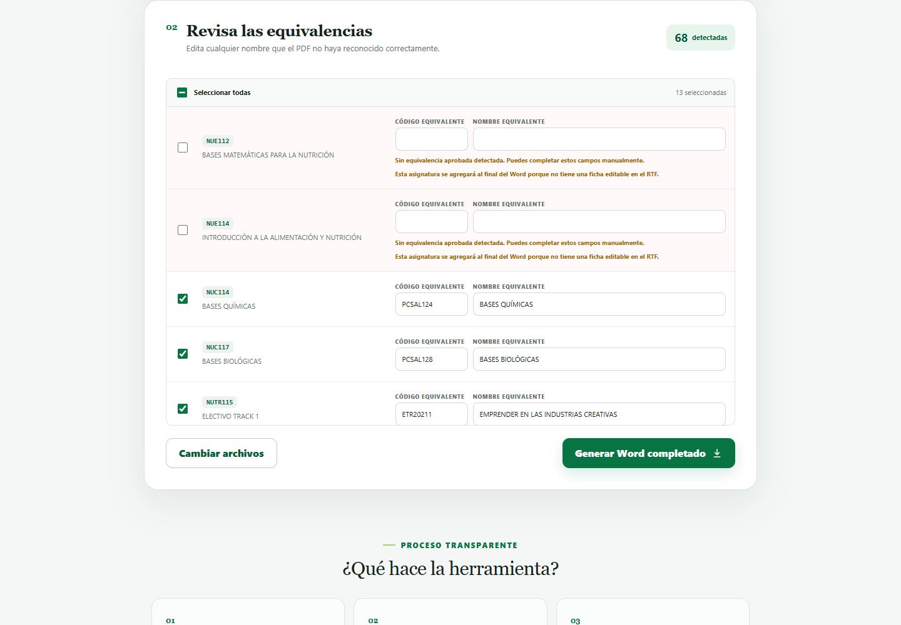

<div align="center">

<h1>Equivalencias para planes de estudio</h1>

<p>Completa automáticamente un plan de estudios RTF con las equivalencias aprobadas encontradas en una ficha curricular PDF.</p>

<a href="https://bravoisaac.github.io/proyecto_Certificado_Plan_Estudios/">
  
</a>

<br /><br />

[](https://bravoisaac.github.io/proyecto_Certificado_Plan_Estudios/)
[](https://equivalencias-plan-estudios.onrender.com/)


</div>



## ¿Qué hace la aplicación?

La herramienta recibe dos documentos:

- Una ficha curricular en formato `.pdf`.
- Un plan de estudios de Word en formato `.rtf`.

Lee las asignaturas del PDF, conserva únicamente las equivalencias aprobadas y agrega cada una dentro de la ficha correspondiente del RTF. El documento original no se modifica: el navegador descarga una copia nueva con el sufijo `_con_equivalencias.rtf`.

## Flujo de trabajo

1. Carga la ficha curricular PDF.
2. Carga el plan de estudios RTF vacío.
3. Presiona **Analizar equivalencias**.
4. Revisa, corrige o desmarca los resultados.
5. Presiona **Generar Word completado**.



## Reglas de procesamiento

Para una oportunidad como:

```text
1 2020/2 6.4 A
RTR20188
LENGUA DE SEÑAS
```

la aplicación descarta intento, periodo, nota y estado, y escribe en el RTF:

```text
EQUIVALENTE: RTR20188 LENGUA DE SEÑAS
```

- Solo se incluyen oportunidades con estado aprobado `A`.
- Primero se busca la asignatura por código exacto.
- Si el plan utiliza otro código, se busca de forma segura por el nombre normalizado.
- Las coincidencias ambiguas no se insertan automáticamente.
- Las asignaturas sin ficha editable se agrupan al final para evitar pérdidas.

## Privacidad y límites

- Los documentos se procesan en memoria y no se guardan en una base de datos.
- En GitHub Pages, los archivos se envían al backend de Render únicamente para procesar la solicitud.
- PDF máximo: 20 MB.
- RTF máximo: 25 MB.
- Solicitud completa máxima: 50 MB.
- Algunos PDF pueden contener caracteres Unicode incompletos; la interfaz permite corregir los nombres antes de generar el documento.

## Ejecutar localmente en Windows

La opción más sencilla es ejecutar `iniciar_app.bat`. En el primer inicio se crea el entorno virtual y se instala la dependencia.

También puedes iniciar el proyecto manualmente:

```powershell
py -m venv .venv
.\.venv\Scripts\Activate.ps1
python -m pip install -r requirements.txt
python server.py
```

Después abre [http://127.0.0.1:8000](http://127.0.0.1:8000).

## Arquitectura y despliegue

```text
GitHub Pages (interfaz estática)
              │
              ▼
Render (API Python en memoria)
              │
              ▼
RTF completado descargado por el navegador
```

- `index.html` y `static/` forman la interfaz publicada por GitHub Pages.
- `server.py` expone los endpoints de análisis y generación.
- `core/pdf_extractor.py` extrae las equivalencias del PDF.
- `core/rtf_editor.py` inserta las equivalencias conservando el formato RTF.
- `render.yaml` configura el backend desplegado en Render.

## Pruebas

```powershell
python -m unittest discover -s tests -v
```

Las pruebas cubren la extracción de equivalencias aprobadas, la reparación de texto, la búsqueda por código o nombre y la inserción dentro de las fichas del RTF.

## Estructura

```text
core/
  pdf_extractor.py       Extracción y filtrado desde PDF
  rtf_editor.py          Edición del RTF
static/
  app.js                 Interacción y consumo de la API
  styles.css             Diseño responsive
tests/                   Pruebas unitarias
index.html               Entrada web y GitHub Pages
server.py                Servidor HTTP y validaciones
render.yaml              Configuración del backend
```

---

<div align="center">
  <a href="https://bravoisaac.github.io/proyecto_Certificado_Plan_Estudios/"><strong>Abrir Equivalencias para planes de estudio</strong></a>
</div>
